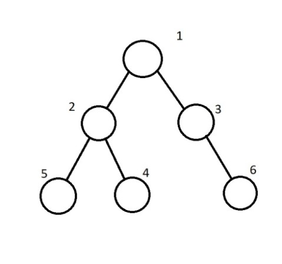
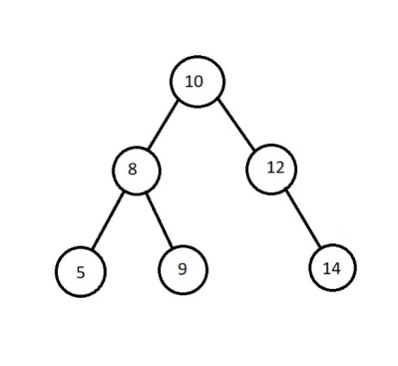
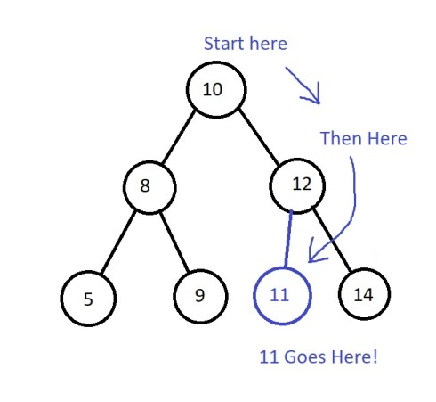
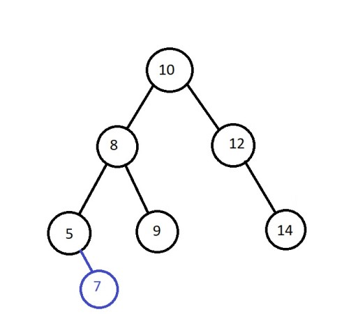
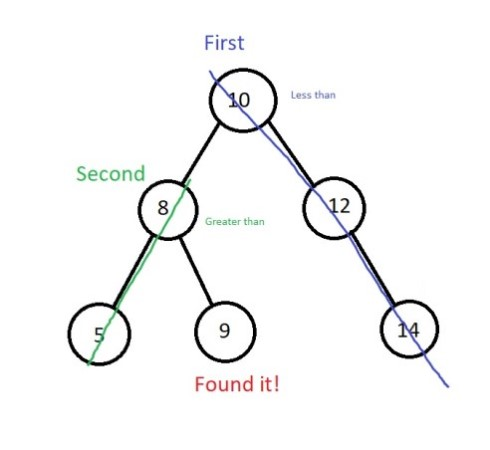
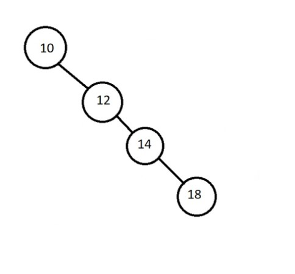
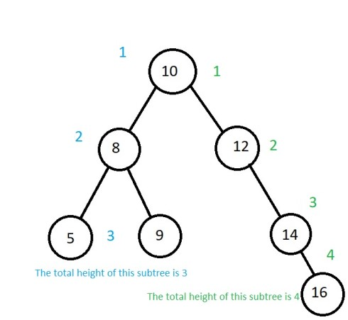
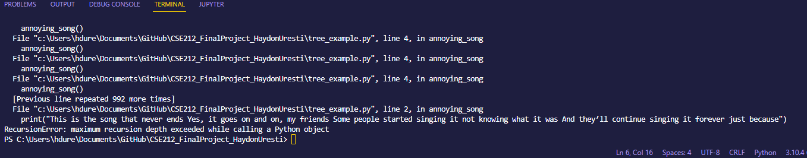
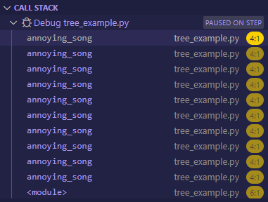

[Return Home](0-welcome.md)

# <span style="color:yellow">Trees!</span>

Trees are a programming data structure where data is connected via pointers (things that point to what data is next). Trees excel in storing and retrieving data. Its performance can range from O(n) to a fast O(log n) depending on its implementation...

There are many different types of tree data structures. We will be going over a couple kinds of binary trees.

# <span style="color:yellow">Binary Trees and Their Parts</span>

This is a diagram of the basic parts of a binary tree, most of its parts are similar or the same as other kinds of trees.



Node - Each bubble represents a node. A node is a space where data is stored. Binary trees have no more than two nodes beneath another.

#1- Root: The root of a tree is its starting node. Everything else in the tree flows from its root.

#2- Parent: A parent node is a node that has connected nodes below it. (#1 and #3 are also parent nodes)

#3- Child: A child node is a node that is below another (a parent) node. (All nodes except the root node is a child node.)

#6- Leaf: A leaf is a node with no connecting nodes. (#4 and #5 are also leaves of the example tree)

Subtree- A subtree is a tree within a tree. In the example, the nodes of #2, #4, and #5 form a subtree. A subtree is formed by any nodes below another.

#

# <span style="color:yellow">Binary Search Trees</span>

A Binary Search Tree (BST) is a binary tree that sorts its data when data is stored in it. It does so by comparing the new data to to data already stored within the tree. If the new data is greater than the data within the parent (root if it is the beginning) node, then the new data will be stored to the right of it or be compared to the data in the parent node of that subtree. </br>
If the new data had been less than the parent node, the data would then be stored on the left side or compared to the parent node of that subtree.

Look at the example tree below. See that it now has data stored in its nodes. </br>


Following the rule of sorting given above if we wanted to add 11 to the list where would it go?

-First, we would check the root node. Since 11 is greater than 10, we then look to the root's right child node.

-11 is then compared to 12. Because 11 is less than 12, we go to the left of the 12 node.

-Because there is no node saved as a left child node of 12, 11 is stored there. </br>


Let's look at the original tree again. Where would we add 7 in the original tree?


<details>
  <summary><span style="color:orange">Answer</span></summary>
 We will add 7 as the right child node of 5.



</details>

Because of how these trees are organized and have their data stored, binary BSTs are very fast to sort through! Each time we compare the given value to the stored value, we are able to cut out half of the remaining values in the tree.

Look at the example below as we look for the stored value of 9.



As we test the desired value against the stored value, we are able to rule out other sections (subtrees) of the tree. This ruling out makes searching through a tree much faster than searching through other data structures, like a list, where you have to look at each piece of data until you find it. Generally, searching a BST happens in O(log n) time due to the ability to cut out part of the values stored in the tree.

What if the BST looks a little different? Maybe something like the one below.



Each of the nodes are linked in a row. It looks more like a list or a linked list than a tree. And because it looks like a list it is going to perform the same as one. Because this tree has no offshoots on the left, there is not way to cut any data out and we are forced to check each value until we find the one we want. This is what we call an <span style="color:orange">unbalanced</span> tree, meaning that one side contains more than a few nodes more than the other.

#

# <span style="color:yellow">Balanced Binary Search Trees</span>

A balanced binary search tree (balanced BST) is the solution to this issue of unbalance. A balanced BST is a BST that does not have a great height discrepancy between any of its subtrees.

The height of a tree is the number of nodes from the root to the leaves of the tree. See the example below.



The total height of the tree above is 4 because that is the greatest height counted. This tree is also still balanced because there is not a great discrepancy between the number of nodes in a subtree. The difference in height is only 1. If we were to add 18 as a child node of 16, the tree would be unbalanced.

<span style="color:yellow">How do we balance a BST?</span>

Because the data we use and store can lead us to have an unbalanced tree, we need a way to re-balance it. There are many ways of doing this, from manually moving the nodes around, to using algorithms to sort the list into a balanced state. A couple of examples of these algorithms are red-black trees, AA trees, and AVL trees.

These algorithms detect if a tree is unbalanced and rearrange the nodes in order to end up with a balanced tree. Doing so allows us to take full advantage of a tree's ability to sort through data quickly.

While incredibly useful, the functionality of these algorithms is outside the scope of this tutorial.

# <span style="color:yellow">Operations of a BST</span>

Out of the data structures we've gone over, BSTs are the most complicated. The operations of a BST and balanced BST are much different than the other data structures as well and take more time to go over. Because of this, we will only be going over the operations of inserting and traversing.

Before going over these operations, we need to go over a concept called recursion as both operations use it.

#

<span style="color:yellow">Recursion</span>

#

Put simply, recursion is a function calling itself. You can think of it kind of like a loop. See an example of a recursive function below.

```python
def annoying_song():
    print("This is the song that never ends Yes, it goes on and on, my friends Some people started singing it not knowing what it was And they′ll continue singing it forever just because")

    annoying_song()
```

While this is a silly example it does show recursion. Each time the function is called, it prints off text and calls the function again. Unfortunately, because of the way the function is written, the program may actually seem to do what the song says and never end because we didn't place any restrictions on it or anything to stop it.

Fortunately there is a safeguard against this infinite number of calls. If we were to call the above function, we would get an error. This is what VS Code will tell us if we run it.



There is a maximum recursion depth built in to stop the program. It needs to happen because too many functions get caught on the call stack. The call stack is stack data structure that we've gone over, that basically keeps track of what function the program is on. These calls build up because if you look at our function, the first call to it never actually ends. Before the first call can end, the next call has to end. Before the second call can end, the third has to end, and so on.
This building up can be seen in the call stack below



To help stop our program from running into a recursion error, we can follow two important rules.

#1- Break your problem up into a smaller problem. This smaller problem will be easier to solve when broken down.

#2- Create a base case. A base case is a stopping point. It will tell our program at what point it can stop and return a value instead of continuing to call itself.

Lets make another recursion example looking at factorials. Factorials are a great example of a great use of recursion. Before we write our code, lets start by applying the recursion rules we laid out.

Applying rule #1:
How can we break the problem up into smaller ones? What are we trying to solve, and how would it be helpful to use recursion?

Well, let's think about factorials. A factorial is a number times all the numbers beneath it. (We're going to focus on positive integer factorials) For example

5! is 5 x 4 x 3 x 2 x 1

so if we were then ask a program to solve 5!, what could we do. Well, we could say that 5! = 5 x (5 - 1)!. In English, this says 5 factorial is equal to 5 times the factorial of the number below 5. We could re-write that equation as i! = i x (i - 1)! to solve for any factorial.

Now that we broke our problem up, we need to create a base case for our program to know when to stop calling itself. What is the end of the factorial number line (the numbers the factorial needs to be multiplied by)? Wo we know what the value of that number will be? Yes, we know it! 1 is the last number our factorial needs to be multiplied by, and we know that 1! = 1. This creates an excellent base case for our function, where we can tell it to stop when it gets to 1! and return 1 instead.
Look at the example below

```python
def factorials(i):
    if n <= 1:   # This if statement is our base case, which we check for first
        return 1 # If our basecase it hit, we return 1

    else:        # If we don't hit our base case, we will call our function again
        return i * factorials(i-1) # We subtract 1 from our current number
```

In effect, for 5!, the call stack with what our functions are doing and actual values plugged in might look something like this,

-Top-

return 1

return 2 \* 1!

return 3 \* 2!

return 4 \* 3!

return 5 \* 4! (this is the original call of the function)

-Bottom-

#

<span style="color:yellow">Operations</span>

Some common BST operations include

#1- insert(value): Inserting into a tree requires the use of recursion to look for the proper place for
our data. As we will use recursion, we will also follow the rules of recursion that we set up.
The smaller problem we will be solving is to determine which side we will store the value on depending on the value. Our base case would be whenever we get to a leaf of the tree (an empty space) where we can store the value.

Doing the actual insertion is also different than the other data structures we've gone over. This is because BSTs are not build into Python, so we will be using a BST class to implement one. Because the BST is a class, each node is its own object.

The way that inserting into a BST is different than other things we've gone over is similar
to the other operations we will go over.

This is an O(log n) operation.

<details>
  <summary><span style="color:orange">An example of code that could be used to insert into a BST</span></summary>

```python
def insert(self, data):
		"""
		Insert the given data into the BST
		This function is first called by the user
		and will create a root node if the BST is empty.
		If BST is not empty, this function will recursively
		call insert_ until the proper empty space is found.
		"""
		if self.root is None:
			self.root = BST.Node(data)
		else:
			self.insert_(data, self.root)

	def insert_(self, data, node):
		"""Looks for the proper location of the data that
		is to be stored.
		"""
		if data > node.data:

			# The data should go on the right.
			if node.data == data:
				return
			elif node.right is None:
				#If the right node is none, then will add
				#the new node here.
				node.right = BST.Node(data)
			elif node.right == data:
				return
			else:
				#We will use recursion and call the function
				#again to continue looking.
				self.insert_(data, node.right)

		else:

			#the data should go on the left side.
			if node.data == data:
				return
			elif node.left is None:
				#If the left node is none, then will add
				#the new node here.
				node.left = BST.Node(data)

			else:
				#We will use recursion and call the function
				#again to continue looking.
				self.insert_(data, node.left)
```

</details>

#

#2- Contains(value): Checks to see if a value is in the BST. This is an O(log n) operation.

<details>
  <summary><span style="color:orange">An example of code that could be used to see if a value is contained in a BST</span></summary>

```python
def __contains__(self, data):
		""" This function makes it possible to use the
		 keyword "in" to determine if data is in the BST
		 already.
		"""
		return self.contains_(data, self.root)

	def contains_(self, data, node):
		"""Like insert_, this funciton is called by
		another (__contains__) recurrsively to look
		through the BST	for a node.
		"""

		if data > node.data:

			#The data will be found on the right side
			if data == node.data:
				return True
			elif node.right is None:
				#there is an empty space so it is False
				return False
			else:
				# We will call the function again
				return self.contains_(data, node.right)

		else:

			#The data will be found on the left side
			if data == node.data:
				return True
			elif node.left is None:
				#there is an empty space so it is False
				return False
			else:
				# We will call the function again
				return self.contains_(data, node.left)
```

</details>

#

#3- traverse_forward: Goes through all the nodes from the smallest
value to the largest. This is an O(n) operation.

<details>
  <summary><span style="color:orange">An example of code that could be used to traverse through a BST forward</span></summary>

```python
    def __iter__(self):
		""" Goes through, or traverses, the BST from the beginning.
		"""
		yield from self.traverse_forwards_(self.root)

	def traverse_forwards_(self, node):
		"""The function called by __iter__ that will recursively
		travers through the BST.
		Uses the "yield" keyword, which acts similarly to "return"
		but does not stop the program.
		"""
		if node is not None:
			#The left side must go first in order to get the
			#smaller values first
			yield from self.traverse_forwards_(node.left)
			yield node.data
			yield from self.traverse_forwards_(node.right)
```

</details>

#

#4- traverse_backward: Goes through all the nodes from the largest
value to the smallest. This is an O(n) operation.

<details>
  <summary><span style="color:orange">An example of code that could be used to traverse through a BST backward</span></summary>

```python
    def __reversed__(self):
		"""Traverses through the BST in reversed order.
		Recursively calls the travers_backwards_ function
		"""
		yield from self.traverse_backwards_(self.root)


	def traverse_backwards_(self, node):
		"""Traverses backwards through the BST.
		This function works in the opposite direction as
		traverse_forwards_
		"""
		if node is not None:
			#The right side must go first in order to get the
			#larger values first
			yield from self.traverse_backwards_(node.right)
			yield node.data
			yield from self.traverse_backwards_(node.left)
```

</details>

#

#5-height: Get the total height of the tree. This is an O(n) operation.

<details>
  <summary><span style="color:orange">An example of code that could be used to find the 
  height of the BST</span></summary>

```python
    def return_height(self):
		"""Finds the height of the BST using the
		function return_height_
		"""

		if self.root is None:
			return 0
		else:
			return self.return_height_(self.root)


	def return_height_(self, node, curr_height=None):
		"""The function recursively called by return_height
		Finds the total height by adding 1 (the root) to the
		height of the right or left sub trees depending on
		which one has the greater height.
		"""

		if node == self.root:
			height = 1
		else: height = curr_height

		if node.right == None and node.left == None:
			return height

		#If the left node is not none while the right is
		# we will continue down the left side and add 1 to height
		elif node.right == None and node.left != None:
			return self.return_height_(node.left, height+1)

		#If the right node is not none while the left is
		# we will continue down the right side and add 1 to height
		elif node.right != None and node.left == None:
			return self.return_height_(node.right, height+1)

		# If both sides have values, we will continue down both
		#sides and the max fucntion will choose the one that is
		#greater and return it
		else:
			return max(self.return_height_(node.right, height+1), self.return_height_(node.left, height+1))
```

This example uses a practice called memoization. This means that we are storing the result of the last function into the next. The data is stored using <span style="color:orange">curr*height=None</span> as a parameter in return_height*. The <span style="color:orange">=None</span> means that on the first iteration, curr_height won't store anything, but can on recursive calls of the function.

</details>

#

#6- empty(): Determines if the BST is empty. This is an O(1) operation.

<details>
  <summary><span style="color:orange">An example of code that could be used to determine if a BST is empty</span></summary>

```python
    def empty(self):
		"""Determines if the BST is empty
		"""
		# If root is None, the list is empty
		if self.root == None:
			return True

		return False
```

</details>

</br>

[See our entire example tree class here](code_examples/tree_example.py)

#

# <span style="color:yellow">Examples using a BST</span>

### <span style="color:yellow">Example</span>

Lets look at an example of using a BST

We're going to write a function to find the sum of the data in
the BST.

As we're going to use recursion we're going to model our function after some of the other recursive functions. We'll use two functions like many of the other functions do.

However, first, lets apply our two rules of recursion. What is the smaller problem we're trying to solve? How can we break our bigger problem down?
Our basic problem is simply adding the data from an individual node to the total sum.

Now what can be a base case for us? At what point should we stop recursion? We will want to stop after we get to a leaf on the tree.

Lets start by writing a function to work as a base case.

```python
def sum_numbers(self):
	#if the root does not exist, we will return 0 as the tree
	#contains no data.
	if self.root == None:
		return 0
	#call the recursive function that will add each piece of
	#data to the total sum.
	else:
		return self.sum_numbers_(self.root)
```

Now lets create the function that will do the adding!

```python
def sum_numbers_(self, node)

#Create a value to contain the sum
sum = 0
sum += node.data
```

Next, we need the part of our function that will continue
going to the next nodes

```python
	#if the node to the right is not none, we will recursively call the function again and use the right node
	if node.right is not None:
		sum += self.sum_numbers_(node.right)

	#if the node to the left is not none, we will recursively call the function again and use the left node
	if node.left is not None:
		sum += self.sum_numbers_(node.left)

	#return the sum. When the callstack gets back to first call
	#the sum will be the total sum of the tree
	return sum
```

When run with the rest of the BST class and the following input, the function will return the following

```python
print("\n=========== Node Height Tests ===========")
tree = BST()
tree.insert(5)
tree.insert(3)
tree.insert(7)
tree.insert(6)
tree.insert(4)
tree.insert(8)

print(tree.sum_numbers()) #33

print("Test 2")

tree1 = BST()
tree1.insert(10)
tree1.insert(4)
tree1.insert(18)
tree1.insert(5)
tree1.insert(11)
tree1.insert(19)

print(tree1.sum_numbers()) #67
```

[See the entire code for the sum_of_tree function](code_examples/sum%20_of_tree.py)

#

## <span style="color:yellow">Now You Try!</span>

Your task is to write a recursive function that will find the height of a given node (given via the data). Here we are defining the height as how far from the root node the node we're looking for is. Because of this, if the node were the root node, the returned height would be 0. If the desired node was a child of the root, the height would be 1, and a child of that would be 2 and so on.

<details>
  <summary><span style="color:orange">Start with the following code</span></summary>

This code contains all the code for the BST class and a start for the two functions we will create. Your job is to add the functionality to the unfinished functions.

```python
class BST:
	"""A binary search tree object. Node is a
	subclass of BST.
	"""

	class Node:
		""" A node of a BST. Starts with a single
		node and is added onto to build a BST.
		"""

		def __init__(self, data):
			"""Creates a node storing the given
			data.
			"""
			self.data = data
			self.left = None
			self.right = None
	def __init__(self):
		"""Initializes an emoty BST
		"""

		self.root = None

	def insert(self, data):
		"""
		Insert the given data into the BST
		This function is first called by the user
		and will create a root node if the BST is empty.
		If BST is not empty, this function will recursively
		call insert_ until the proper empty space is found.
		"""
		if self.root is None:
			self.root = BST.Node(data)
		else:
			self.insert_(data, self.root)

	def insert_(self, data, node):
		"""Looks for the proper location of the data that
		is to be stored.
		"""
		if data > node.data:

			# The data should go on the right.
			if node.data == data:
				return
			elif node.right is None:
				#If the right node is none, then will add
				#the new node here.
				node.right = BST.Node(data)
			elif node.right == data:
				return
			else:
				#We will use recursion and call the function
				#again to continue looking.
				self.insert_(data, node.right)

		else:

			#the data should go on the left side.
			if node.data == data:
				return
			elif node.left is None:
				#If the left node is none, then will add
				#the new node here.
				node.left = BST.Node(data)

			else:
				#We will use recursion and call the function
				#again to continue looking.
				self.insert_(data, node.left)


	def __iter__(self):
		""" Goes through, or traverses, the BST from the beginning.
		"""
		yield from self.traverse_forwards_(self.root)

	def traverse_forwards_(self, node):
		"""The function called by __iter__ that will recursively
		travers through the BST.
		Uses the "yield" keyword, which acts similarly to "return"
		but does not stop the program.
		"""
		if node is not None:
			#The left side must go first in order to get the
			#smaller values first
			yield from self.traverse_forwards_(node.left)
			yield node.data
			yield from self.traverse_forwards_(node.right)


	def __contains__(self, data):
		""" This function makes it possible to use the
		 keyword "in" to determine if data is in the BST
		 already.
		"""
		return self.contains_(data, self.root)

	def contains_(self, data, node):
		"""Like insert_, this funciton is called by
		another (__contains__) recurrsively to look
		through the BST	for a node.
		"""

		if data > node.data:

			#The data will be found on the right side
			if data == node.data:
				return True
			elif node.right is None:
				#there is an empty space so it is False
				return False
			else:
				# We will call the function again
				return self.contains_(data, node.right)

		else:

			#The data will be found on the left side
			if data == node.data:
				return True
			elif node.left is None:
				#there is an empty space so it is False
				return False
			else:
				# We will call the function again
				return self.contains_(data, node.left)

	def __reversed__(self):
		"""Traverses through the BST in reversed order.
		Recursively calls the travers_backwards_ function
		"""
		yield from self.traverse_backwards_(self.root)


	def traverse_backwards_(self, node):
		"""Traverses backwards through the BST.
		This function works in the opposite direction as
		traverse_forwards_
		"""
		if node is not None:
			#The right side must go first in order to get the
			#larger values first
			yield from self.traverse_forwards_(node.right)
			yield node.data
			yield from self.traverse_forwards_(node.left)

	def return_height(self):
		"""Finds the height of the BST using the
		function return_height_
		"""

		if self.root is None:
			return 0
		else:
			return self.return_height_(self.root)


	def return_height_(self, node, curr_height=None):
		"""The function recursively called by return_height
		Finds the total height by adding 1 (the root) to the
		height of the right or left sub trees depending on
		which one has the greater height.
		"""

		if node == self.root:
			height = 1
		else: height = curr_height

		if node.right == None and node.left == None:
			return height

		#If the left node is not none while the right is
		# we will continue down the left side and add 1 to height
		elif node.right == None and node.left != None:
			return self.return_height_(node.left, height+1)

		#If the right node is not none while the left is
		# we will continue down the right side and add 1 to height
		elif node.right != None and node.left == None:
			return self.return_height_(node.right, height+1)

		# If both sides have values, we will continue down both
		#sides and the max fucntion will choose the one that is
		#greater and return it
		else:
			return max(self.return_height_(node.right, height+1), self.return_height_(node.left, height+1))

	def empty(self):
		"""Determines if the BST is empty
		"""
		# If root is None, the list is empty
		if self.root == None:
			return True

		return False


	##########Find the height of a node##########

	def find_node_height(self, data):
		"""Finds the height (what level of the tree)
		a given piece of data is.
		"""
		pass

	def find_node_height_(self, data, node, height=None):
		"""A recursive function that searches a piece
		of data in a tree and counts the how many levels
		it is from the root. The root will be considered 0.
		"""
		pass
```

</details>

</br>
After the functions are implemented, run the following test.

```python
print("\n=========== Node Height Tests ===========")
tree = BST()
tree.insert(5)
tree.insert(3)
tree.insert(7)
tree.insert(4)
tree.insert(10)
tree.insert(1)
tree.insert(6)
tree.insert(12)
tree.insert(2)
tree.insert(20)

print(tree.find_node_height(7))  #1


print(tree.find_node_height(10))  #2

print(tree.find_node_height(12))  #3

print(tree.find_node_height(1))  #2

print(tree.find_node_height(5))  #1

print(tree.find_node_height(20))  #4

print(tree.find_node_height(30))  # The BST does not contain the data
```

<details>
  <summary><span style="color:orange">Tips</span></summary>
Look at how other functions in the BST class are modeled. The contain functions may be particularly helpful.

Use the memoization given to you to store the height throughout each recursive call.

Remember to use the our rules of recursion.

</details>

<details>
  <summary><span style="color:orange">A possible solution to sum_of_tree</span></summary>
<details>
  <summary><span style="color:orange">Make sure you've given the problem a good try first</span></summary>
<details>
  <summary><span style="color:orange">No cheating!</span></summary>

[Possible solution to sum_of_tree](code_examples/find_node_height.py)

</details>
</details>
</details>

#

Great job! You've completed tutorials on 3 data structure! I hope this has been a good learning experience that has given you new insight and good practice.

[Previous Tutorial](2-sets.md)

[Return Home](0-welcome.md)
